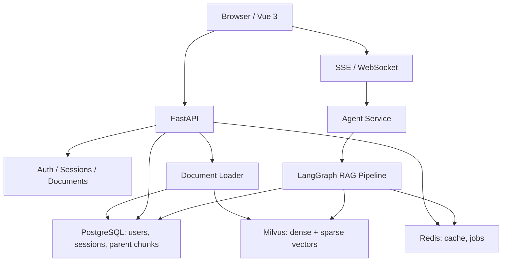

# PaperRAG

PaperRAG 是一个面向学术论文的 RAG 知识库平台，重点处理论文中的复杂版式、公式、定理、证明、引文和多轮问答溯源。

项目当前包含 FastAPI 后端、Vue 3/Vite 前端、Milvus 向量库、PostgreSQL、Redis，以及文档解析、混合检索、Agent 问答、RAG Trace 和异步文档任务等能力。

## 核心能力

- 学术文档解析：PDF/Word/Excel 加载，学术文本清洗，结构化分块。
- 学术结构识别：定理、证明、定义、公式、引文、术语表。
- 混合检索：BGE-M3 dense embedding、BM25 sparse embedding、Milvus hybrid search。
- 检索增强：公式检索、引文优先、Rerank、Auto-merging、Context Expansion。
- 查询改写：HyDE、Step-back、多轮相关性评分与重检索。
- Agent 问答：LangChain/LangGraph 工具调用，SSE/WebSocket 流式输出。
- 产品能力：用户认证、会话历史、文档上传、任务进度、RAG Trace、引用展示。
- 工程能力：Docker Compose、本地缓存、健康检查、限流、测试与 CI 配置。

## 架构概览



更完整的架构梳理、优缺点与路线图见：

- [docs/architecture-review-and-improvement-plan.md](docs/architecture-review-and-improvement-plan.md)

## 技术栈

| 层级 | 技术 |
| --- | --- |
| 后端 | Python 3.12, FastAPI, SQLAlchemy, Alembic, SlowAPI |
| Agent/RAG | LangChain, LangGraph, Pydantic, sentence-transformers |
| 向量检索 | Milvus, dense vector, sparse BM25, RRF, rerank |
| 数据层 | PostgreSQL, Redis, MinIO, etcd |
| 前端 | Vue 3, Vite, TypeScript, vue-i18n, marked, KaTeX |
| 部署 | Docker, Docker Compose, Nginx |
| 测试 | pytest, pytest-asyncio, pytest-cov, ruff |

## 目录结构

```text
PaperRAG/
  backend/
    api/              HTTP/WebSocket 路由
    core/             配置、数据库、认证、依赖容器、日志、限流
    rag/              文档解析、Embedding、检索、RAG Graph
    services/         Agent、缓存、任务、工具服务
    agent/            新一代 LangGraph Agent 与引用校验
    vectordb/         Milvus 客户端与写入逻辑
  frontend/
    src/              Vue 3 + TypeScript 应用源码
    package.json      前端脚本与依赖
  docs/               架构、计划和评审文档
  tests/              单元测试与集成测试
  alembic/            数据库迁移
  docker-compose.yml  本地基础设施与后端服务编排
  pyproject.toml      Python 项目与测试配置
```

## 快速开始

### 1. 准备环境

需要：

- Python 3.12+
- Docker / Docker Compose
- 推荐使用 uv 管理 Python 依赖
- Node.js 20+ 用于前端开发

### 2. 安装后端依赖

```bash
uv sync
```

或使用 pip：

```bash
python -m venv .venv
source .venv/bin/activate
pip install -U pip
pip install -e ".[test]"
```

Windows PowerShell：

```powershell
python -m venv .venv
.venv\Scripts\Activate.ps1
pip install -U pip
pip install -e ".[test]"
```

### 3. 配置环境变量

```bash
cp .env.example .env
```

至少配置：

```env
LLM_API_KEY=your_api_key
LLM_BASE_URL=https://your-llm-endpoint/v1
LLM_MODEL=your_model
JWT_SECRET_KEY=replace-with-a-strong-random-secret
```

兼容旧变量：

```env
ARK_API_KEY=your_api_key
BASE_URL=https://your-llm-endpoint/v1
MODEL=your_model
```

### 4. 启动基础设施

```bash
docker compose up -d postgres redis etcd minio standalone attu
```

常用端口：

| 服务 | 端口 | 用途 |
| --- | --- | --- |
| PostgreSQL | 5432 | 用户、会话、父级分块、知识图谱 |
| Redis | 6379 | 缓存、任务状态 |
| Milvus | 19530 | 向量检索 |
| MinIO | 9000/9001 | Milvus 对象存储 |
| Attu | 8080 | Milvus Web 管理 |

### 5. 启动后端

```bash
uv run uvicorn backend.app:app --host 0.0.0.0 --port 8000 --reload
```

访问：

- 应用入口：http://127.0.0.1:8000/
- API 文档：http://127.0.0.1:8000/docs
- 健康检查：http://127.0.0.1:8000/health

### 6. 前端开发模式

```bash
cd frontend
npm install
npm run dev
```

构建：

```bash
npm run build
```

后端会优先挂载 `frontend/dist/`；如果不存在，则回退挂载 `frontend/`。

## 主要 API

| 方法 | 路径 | 说明 |
| --- | --- | --- |
| POST | `/api/v1/auth/register` | 注册 |
| POST | `/api/v1/auth/login` | 登录 |
| POST | `/api/v1/auth/refresh` | 刷新 token |
| GET | `/api/v1/auth/me` | 当前用户 |
| GET | `/api/v1/sessions` | 会话列表 |
| GET | `/api/v1/sessions/{session_id}` | 会话消息 |
| DELETE | `/api/v1/sessions/{session_id}` | 删除会话 |
| POST | `/api/v1/chat` | 同步聊天 |
| POST | `/api/v1/chat/stream` | SSE 流式聊天 |
| WS | `/api/v1/ws/chat?token=...` | WebSocket 流式聊天 |
| GET | `/api/v1/documents` | 文档列表 |
| POST | `/api/v1/documents/upload/async` | 异步上传文档 |
| GET | `/api/v1/documents/upload/jobs/{job_id}` | 查询上传任务 |
| POST | `/api/v1/documents/ingest` | 增量导入目录 |
| DELETE | `/api/v1/documents/delete/async/{filename}` | 异步删除文档 |
| POST | `/api/v1/cache/clear` | 清空缓存 |
| GET | `/api/v1/stats/usage` | 使用统计 |

## 测试与质量检查

```bash
uv run pytest
uv run pytest --cov=backend
uv run ruff check .
```

前端：

```bash
cd frontend
npm run typecheck
npm run build
```

## 当前已知问题

- 代码注释中存在历史编码污染，建议后续逐步修复。
- `frontend/style.css` 仍为单体文件（~26KB），建议按组件拆分。
- 生产环境需要强制设置 JWT secret、CORS、上传限制等安全基线。

详细分析与计划见 [架构评审与改进计划](docs/architecture-review-and-improvement-plan.md)。

## GitHub SSH 说明

如果使用多个 GitHub 账号，remote URL 需要匹配 `~/.ssh/config` 中的 Host 别名。例如：

```bash
git remote set-url origin git@github.com-creator:DGitHub-Creator/PaperRAG.git
```

测试：

```bash
ssh -T git@github.com-creator
```

## License

MIT
