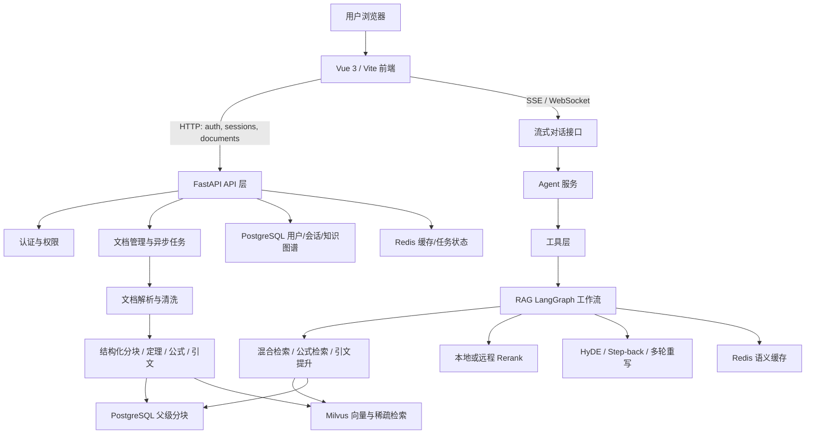
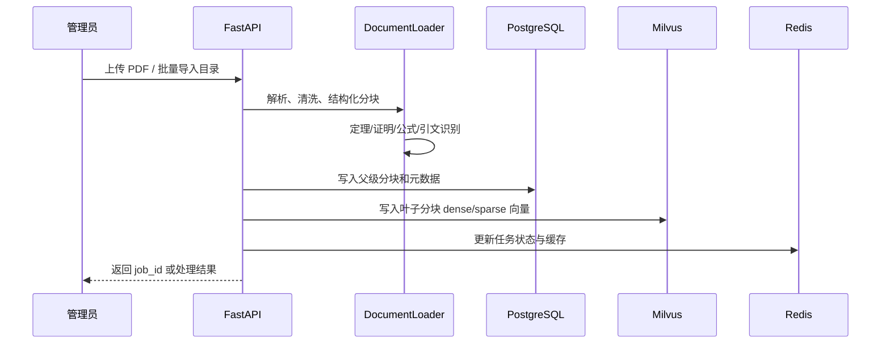
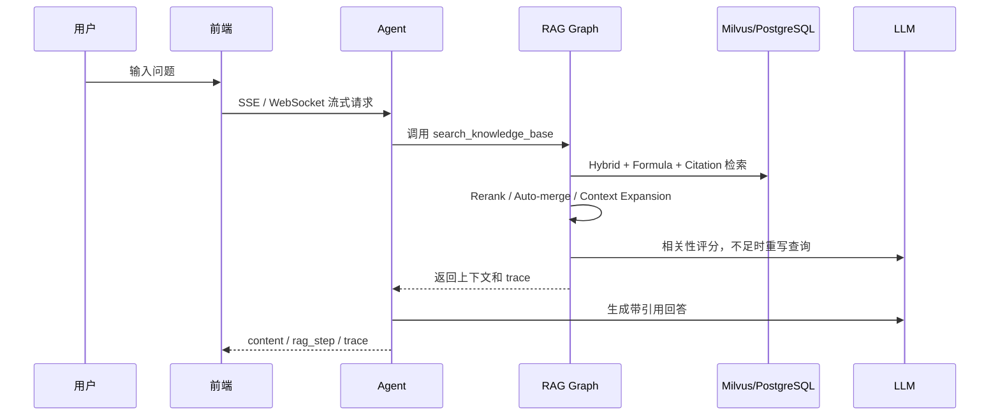

# PaperRAG 架构梳理、优缺点与改进计划

更新时间：2026-06-22

## 1. 项目定位

PaperRAG 是一个面向学术论文的检索增强生成平台。系统围绕“上传论文、结构化解析、向量化入库、混合检索、Agent 问答、引用溯源”构建，适合处理包含公式、定理、证明、引文和复杂版式的论文资料。

当前项目已经从单一 RAG Demo 演进为较完整的 Web 应用：后端使用 FastAPI，前端使用 Vue 3 + Vite，数据层包含 PostgreSQL、Redis、Milvus，以及 Milvus 依赖的 MinIO/etcd。

## 2. 架构总览

## 3. 主要模块职责

### 3.1 前端层

路径：`frontend/`

- `src/`：Vue 3 + TypeScript + Vite 主应用。
- `src/components/`：认证面板、聊天视图、历史侧栏、RAG Trace、设置页等。
- `src/composables/`：`useAuth`、`useChat`、`useDocuments`、`useSessions`、`useWebSocket` 等状态与 API 封装。
- `src/services/api.ts`：后端接口客户端。
- `src/i18n/`：中英文国际化资源。
- 根目录仍保留 `index.html`、`script.js`、`style.css` 旧版静态入口。

### 3.2 API 与应用层

路径：`backend/app.py`、`backend/api/`

- `backend/app.py`：FastAPI 应用工厂、CORS、限流、请求统计、路由挂载、前端静态文件挂载。
- `backend/api/auth.py`：注册、登录、当前用户与刷新令牌等认证端点。
- `backend/api/sessions.py`：会话列表、会话消息读取与会话删除端点。
- `backend/api/routes.py`：聊天、文档上传/删除、增量导入、缓存、统计等 HTTP 端点。
- `backend/api/ws.py`：WebSocket 聊天与流式事件桥接。
- `backend/api/health.py`：健康检查。

### 3.3 核心基础设施层

路径：`backend/core/`

- `config.py`：集中读取环境变量与路径配置。
- `database.py`：SQLAlchemy Engine、Session、Base、初始化。
- `models.py`：用户、会话、消息、父级分块、论文节点、引用边、术语表等 ORM 模型。
- `auth.py`：JWT、密码哈希、RBAC、依赖注入。
- `dependencies.py`：懒加载单例容器，管理 Embedding、Milvus、RAG Graph、模型、存储等重型对象。
- `rate_limit.py`、`stats.py`、`logging_config.py`：限流、统计和日志。

### 3.4 文档解析与 RAG 层

路径：`backend/rag/`

- `document_loader.py`：多格式文档加载、PDF 多解析器降级、结构化分块入口。
- `academic_cleaner.py`：学术论文页眉页脚、参考文献、重复行等清洗。
- `layout_analyzer.py`、`multimodal.py`：版式和多模态辅助处理。
- `theorem_detector.py`：定理、引理、证明、定义等结构识别。
- `formula_normalizer.py`、`formula_index.py`：公式提取、归一化、LSH 索引。
- `citation_extractor.py`：引文标记提取。
- `embedding.py`：BGE-M3 稠密向量、BM25 稀疏向量、统计持久化。
- `parent_chunk_store.py`：父级分块存入 PostgreSQL/Redis，用于 Auto-merging 和上下文扩展。
- `rag_utils.py`：核心检索函数，包含公式检索、Hybrid Search、Rerank、Auto-merge、Context Expansion、Citation Boost、HyDE、Step-back。
- `rag_pipeline.py`：LangGraph RAG 状态图，负责初检索、相关性评分、问题重写、多轮检索。

### 3.5 Agent 与服务层

路径：`backend/services/`、`backend/agent/`

- `backend/services/agent.py`：会话持久化、LangChain Agent 创建、同步/流式聊天、SSE 事件输出。
- `backend/services/tools.py`：Agent 工具，封装知识库检索、天气工具、RAG step 推送和工具调用保护。
- `backend/services/cache.py`：Redis 缓存与语义缓存。
- `backend/services/upload_jobs.py`：上传/删除/批量导入任务状态管理。
- `backend/agent/core.py`：新一代两层 LangGraph Agent，包含 intent router、response agent、工具循环。
- `backend/agent/verify.py`：引用校验结果抽取。

### 3.6 向量库与数据层

路径：`backend/vectordb/`、`docker-compose.yml`

- `Milvus`：存储叶子分块的 dense/sparse 向量、元数据，支持 hybrid search。
- `PostgreSQL`：用户、会话、消息、父级分块、知识图谱实体关系。
- `Redis`：聊天缓存、语义缓存、任务状态或热点数据。
- `MinIO + etcd`：Milvus Standalone 依赖组件。

## 4. 核心业务流程

### 4.1 文档入库

### 4.2 问答检索

## 5. 架构优点

1. 领域建模清晰：围绕学术论文的真实难点加入了公式、定理、引文、版式、父子分块等专项能力，不是普通文档 RAG 的简单套壳。
2. 检索链路完整：Hybrid Search、BM25、Rerank、Auto-merging、Context Expansion、HyDE、Step-back、多轮相关性评分形成了较强的召回与纠错能力。
3. 数据层分工合理：Milvus 负责向量检索，PostgreSQL 负责结构化元数据和会话，Redis 负责缓存与状态，边界基本清楚。
4. 前后端具备产品闭环：包含认证、会话历史、文档上传、异步任务进度、RAG Trace、WebSocket/SSE 流式体验。
5. 依赖懒加载设计较好：`backend/core/dependencies.py` 避免模型、Milvus 客户端、Graph 等重对象在模块导入时立即初始化。
6. 可观测性已有雏形：日志、健康检查、请求统计、RAG step、RAG trace 能帮助定位检索链路问题。
7. 测试目录较完整：已有单元测试、集成测试、CI 工作流、覆盖率配置，为后续重构提供基础安全网。

## 6. 架构缺点与风险

1. README 和大量源码注释出现编码污染，降低维护效率，也会影响新成员理解系统。
2. `backend/api/routes.py` 体量过大，认证、会话、文档、任务、统计、缓存混在一个文件里，变更风险高。
3. 存在两套 Agent 路径：`backend/services/agent.py` 的 LangChain Agent 与 `backend/agent/core.py` 的新 LangGraph Agent 并存，入口和责任边界不够清晰。
4. 前端存在旧版静态文件和 Vite 源码两套形态，部署入口和维护责任容易混淆。
5. 异步任务仍依赖 FastAPI BackgroundTasks 或进程内状态，虽然已有 Redis Job Manager 开关，但多 worker、重启恢复、任务取消能力仍不足。
6. 部分配置在导入时创建目录或初始化全局状态，部署、测试、只读环境下可能产生副作用。
7. 模型缓存和 `frontend/node_modules`、`models` 等大目录曾出现在远端历史/工作区中，说明仓库边界和 LFS/ignore 策略需要进一步收紧。
8. 引用与证据链能力尚未完全打通：已有 `CitationChips`、`citation_extractor`、`verify`，但旧 Agent 与新 Agent 的 source_map、citation verification 输出不统一。
9. 安全基线仍需强化：默认 JWT secret、默认 admin invite code、CORS `*`、WebSocket token query 参数、上传文件路径/大小限制都需要生产化审计。
10. 文档计划较分散：`docs/plan-*`、`archive/`、`compose/` 与 README 内容重复，缺少一个当前有效的路线图入口。

## 7. 改进计划

### Phase 1：文档与仓库卫生

目标：让项目能被准确理解和稳定拉取。

- 修复 README、核心文档和源码注释的编码问题。
- 明确保留 Vite/Vue 作为唯一前端开发入口，旧版 `frontend/script.js` 和 `frontend/style.css` 标记为 legacy 或迁移删除。
- 收紧 `.gitignore` 和 LFS 策略，确保 `models/`、`frontend/node_modules/`、`.coverage`、`logs/`、`volumes/` 不再进入正常提交。
- 合并或归档过期 `docs/plan-*`，保留本文件作为当前路线图入口。
- 在 README 中加入“架构图、启动方式、主要模块、文档索引、常见故障”。

验收标准：

- `git status` 不再因为模型缓存、node_modules 或日志产生噪音。
- README 能在 GitHub 上正常显示中文。
- 新成员能根据 README 在 15 分钟内启动基础依赖和后端。

### Phase 2：API 分层与服务边界

目标：降低 `routes.py` 的维护成本。

- 将 `backend/api/routes.py` 拆分为 `auth.py`、`chat.py`、`sessions.py`、`documents.py`、`jobs.py`、`stats.py`。
- 将文档上传、删除、增量导入的业务逻辑移入 `backend/services/document_service.py`。
- 将会话存储从 `services/agent.py` 拆出到 `backend/services/conversation_storage.py`。
- 为每个 router 建立独立单元测试和错误响应约定。

验收标准：

- 单个 API 文件不超过约 300 行。
- API 层只负责参数校验、依赖注入和响应转换，业务流程在 service 层。
- 现有 API 路径兼容。

### Phase 3：统一 Agent 与 RAG 入口

目标：消除双 Agent 路径造成的行为分裂。

- 明确旧 Agent 和新 Agent 的取舍：推荐以 `backend/agent/core.py` 的 LangGraph Agent 作为目标架构。
- 统一 `search_knowledge_base` 的返回格式，包括 `retrieved_chunks`、`source_map`、`citations`、`unsupported_claims`。
- 将 citation verification 接入主流式响应，而不是仅新 Agent 路径可用。
- 为 RAG trace 定义 Pydantic Schema，避免前后端字段漂移。
- 加入基于固定样例文档的 RAG 评测脚本，覆盖召回、引用、拒答、公式查询。

验收标准：

- 前端只依赖一套 trace/citation event 协议。
- Agent 对同一问题的工具调用次数、引用格式、拒答策略可预测。
- 评测脚本可在 CI 或本地一键运行。

### Phase 4：任务系统生产化

目标：让大文件入库和批量导入可恢复、可观测、可取消。

- 将上传、删除、批量导入任务迁移到 Redis-backed Job Manager 或独立任务队列。
- 引入任务状态持久化字段：created_at、updated_at、started_at、finished_at、error_code、retry_count。
- 支持任务取消、失败重试、幂等重跑。
- 将文件解析、向量写入、BM25 更新、公式索引构建拆成可重试步骤。

验收标准：

- 服务重启后可查询未完成任务状态。
- 同一文件重复提交不会造成重复向量或脏 BM25 统计。
- 失败任务能给出明确错误阶段。

### Phase 5：安全与部署基线

目标：将开发配置和生产配置分离。

- 强制生产环境设置 `JWT_SECRET_KEY`、`ADMIN_INVITE_CODE`、`ALLOWED_ORIGINS`。
- 上传文件增加大小限制、扩展名白名单、路径穿越防护和内容类型校验。
- WebSocket 认证优先使用短期 token 或子协议方案，降低 query token 泄露风险。
- Docker Compose 区分 dev/prod，并提供 `.env.production.example`。
- 增加 `/health`、`/ready`、`/metrics` 或结构化日志，便于运维监控。

验收标准：

- 默认配置不再适合直接生产启动。
- 安全关键配置缺失时服务启动失败或发出明确错误。
- 部署文档覆盖本地开发、单机生产、反向代理三种模式。

### Phase 6：检索质量与学术能力增强

目标：把已有学术特性转化为可验证质量提升。

- 为公式检索、引文检索、术语表、知识图谱建立统一索引更新流程。
- 将 `PaperNode`、`CitationEdge`、`GlossaryEntry` 与文档入库流程完整打通。
- 引入查询分类：定义型、公式型、证明型、对比型、引用型、综述型，不同类型采用不同检索策略。
- 增加 citation-grounded answer 检查，禁止无来源的关键事实陈述。
- 建立小型黄金集，持续比较 Hybrid、Rerank、Auto-merge、HyDE 的收益。

验收标准：

- 每类问题都有固定评测样例。
- 回答中的主要事实能映射到具体文件、页码、chunk。
- 检索策略变更有量化指标支持。

## 8. 推荐优先级

| 优先级 | 工作项 | 原因 |
| --- | --- | --- |
| P0 | 仓库卫生、README、编码修复 | 影响所有协作者和后续提交质量 |
| P0 | API 拆分和 service 边界 | 当前 `routes.py` 是主要复杂度集中点 |
| P1 | 统一 Agent/RAG 输出协议 | 影响前端展示、引用可信度和长期维护 |
| P1 | 任务系统持久化 | 影响大文件和批量入库的可靠性 |
| P2 | 生产安全基线 | 影响公开部署风险 |
| P2 | 学术评测与知识图谱闭环 | 影响长期效果和差异化能力 |

## 9. 近期行动清单

- [ ] 修复 README 与核心文档编码，确认 GitHub 页面显示正常。
- [x] 清理或隔离 `frontend/node_modules`、`models`、`logs`、`.coverage` 等本地生成内容。
- [x] 拆分 `backend/api/routes.py` 的认证、会话与聊天路由。
- [x] 为 `search_knowledge_base` 返回结果定义 Pydantic Schema。
- [x] 将文档上传任务状态在生产环境默认切到 Redis-backed 管理。
- [x] 建立最小 RAG 回归样例与评测脚本入口。
